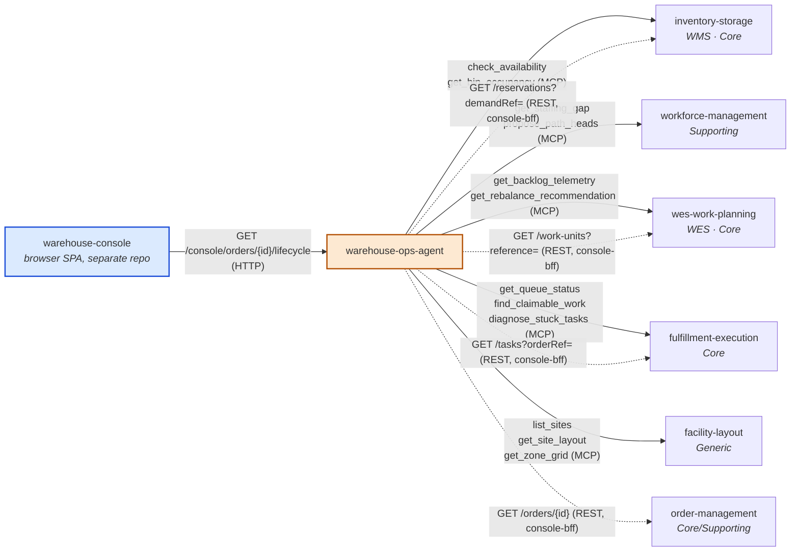

# Context map

`warehouse-ops-agent` carries **two distinct relationships** to the rest
of the fleet, added in two different phases and never merged into one:

1. **MCP Customer of all five original bounded contexts** (unchanged from
   ADR-0001) — the daily-brief and flow-balance-exception use cases read
   each context's published MCP Open Host Service, synchronously, at
   request time.
2. **REST fan-out host for `console-bff`** (new, [ADR
   0002](../adr/0002-micro-frontend-console-architecture.md)) — the
   `GET /console/orders/{id}/lifecycle` route is a *second, separate*
   driving use case that calls four contexts' plain REST APIs (not MCP)
   on behalf of the `warehouse-console` browser SPA: `order-management`,
   `inventory-storage`, `wes-work-planning`, and `fulfillment-execution`.
   `facility-layout` and `workforce-management` are not part of this
   fan-out — no order-lifecycle stage touches them.

These are deliberately kept as two separate outbound adapter families
(`internal/adapters/outbound/mcpclient/` and
`internal/adapters/outbound/restclient/`) rather than unified, because
they answer different questions for different callers: an LLM host
asking "what needs attention right now" versus a browser rendering "what
happened to order X" for a human.

Solid edges are the original MCP-Customer relationship; dashed edges are
the new `console-bff` REST fan-out. Both point outward from this agent —
nothing here ever gains write access to any of the six contexts.

## Relationship table

| Service | MCP relationship (E1/E2/E3) | console-bff relationship |
|---|---|---|
| `order-management` | none | Customer — `GET /orders/{id}` |
| `inventory-storage` | Customer — usable-stock and bin-occupancy facts | Customer — `GET /reservations?demandRef=` |
| `wes-work-planning` | Customer — backlog telemetry and rebalance recommendations | Customer — `GET /work-units?reference=` |
| `fulfillment-execution` | Customer — queue status and stuck-task diagnostics | Customer — `GET /tasks?orderRef=` (joined via each WorkUnit's id, not the plain order id — see ADR 0002) |
| `workforce-management` | Customer — staffing gap | none |
| `facility-layout` | Customer — site structure | none |

## What is deliberately absent

This agent has **no Kafka integration** — it reads exclusively via MCP
tool calls, synchronously, at request time. It does not subscribe to any
of the five contexts' domain events, and it publishes none of its own. A
future telemetry-backed slice (reading OTel/Prometheus directly, per the
placement ADR's mention of live telemetry) is not built yet — the
`internal/adapters/outbound/telemetry` package is a stub.

It also has **no cross-repo Go dependency** on any of the five contexts,
by construction: `internal/architecture/architecture_test.go`'s
`TestNoDirectDependencyOnBoundedContexts` fails the build if one is ever
introduced, and the domain-layer types in `internal/domain/policy`
(`RebalanceAction`, `TaskType`, and so on) are hand-mirrored copies of the
upstream enums, validated at the tool-boundary rather than imported.

## Why this agent, and not one of the five contexts, owns the correlation

See [Domain vision](../business-context/domain-vision.md) and
[ADR 0001](../adr/0001-warehouse-ops-agent-placement.md): none of the five
contexts is the natural owner of cross-context correlation, and embedding
it in any one of them would invert that context's dependency direction
and blur its boundary.
