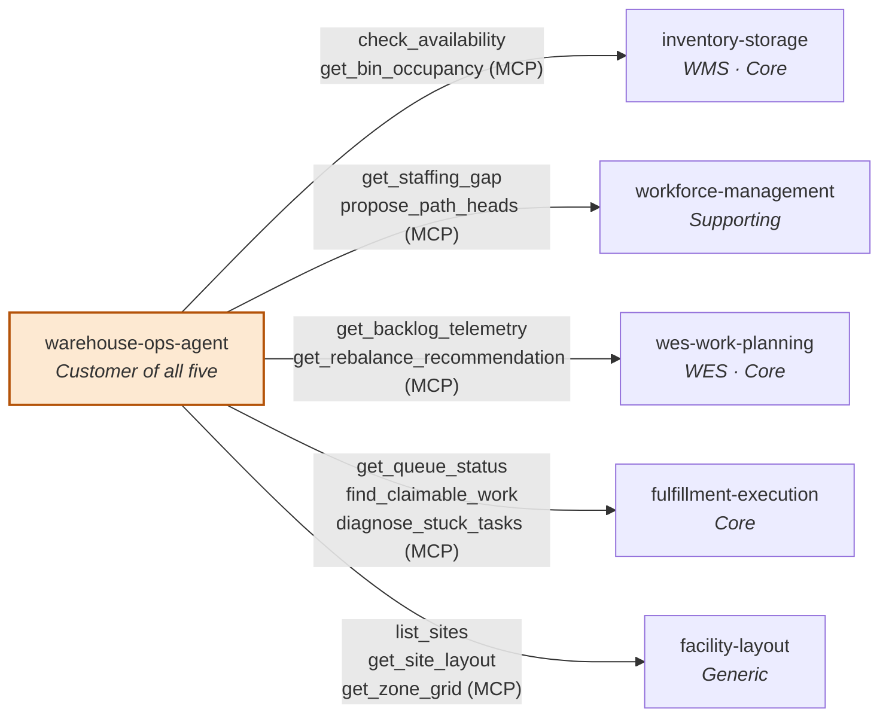

# Context map

`warehouse-ops-agent` is a **Customer** of all five warehouse-systems
bounded contexts, reading each one's published MCP Open Host Service.
Unlike `order-management` (which is a Customer of two contexts' REST
APIs), this agent depends on the full fleet, and depends on none of them
through their REST APIs — only through the MCP tool surface each already
publishes for AI-ecosystem consumption.

## Relationship table

| Service | This agent's relationship to it |
|---|---|
| `inventory-storage` | Customer — reads usable-stock and bin-occupancy facts for E2 |
| `wes-work-planning` | Customer — reads backlog telemetry and rebalance recommendations for E1 and E3 |
| `fulfillment-execution` | Customer — reads queue status and stuck-task diagnostics for E1, E2, and E3 |
| `workforce-management` | Customer — reads staffing gap for E1 and E3 |
| `facility-layout` | Customer — reads site structure to group the daily brief |

## What is deliberately absent

This agent has **no Kafka integration** — it reads exclusively via MCP
tool calls, synchronously, at request time. It does not subscribe to any
of the five contexts' domain events, and it publishes none of its own. A
future telemetry-backed slice (reading OTel/Prometheus directly, per the
placement ADR's mention of live telemetry) is not built yet — the
`internal/adapters/outbound/telemetry` package is a stub.

It also has **no cross-repo Go dependency** on any of the five contexts,
by construction: `internal/architecture/architecture_test.go`'s
`TestNoDirectDependencyOnBoundedContexts` fails the build if one is ever
introduced, and the domain-layer types in `internal/domain/policy`
(`RebalanceAction`, `TaskType`, and so on) are hand-mirrored copies of the
upstream enums, validated at the tool-boundary rather than imported.

## Why this agent, and not one of the five contexts, owns the correlation

See [Domain vision](../business-context/domain-vision.md) and
[ADR 0001](../adr/0001-warehouse-ops-agent-placement.md): none of the five
contexts is the natural owner of cross-context correlation, and embedding
it in any one of them would invert that context's dependency direction
and blur its boundary.
