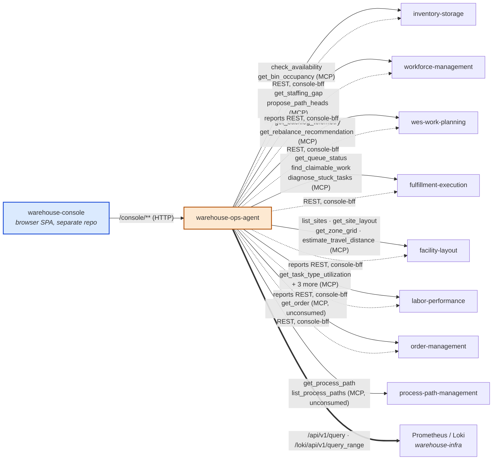

# Context map

`warehouse-ops-agent` carries **three distinct relationships** to the rest
of the fleet, added in different phases and never merged into one:

1. **MCP Customer** (ADR 0001, extended by
   [ADR 0007](../adr/0007-second-wave-outbound-mcp-clients.md)) — the
   daily-brief, flow-balance-exception and explain-travel-factor use cases
   read each context's published MCP Open Host Service, synchronously, at
   request time. Clients exist for eight contexts: the five original ones
   plus `labor-performance` (consumed by the
   [ADR 0008](../adr/0008-labor-utilization-advisory-correlation.md)
   utilization overlay), `order-management` and `process-path-management`
   (wired, not yet consumed by any use case).
2. **REST fan-out host for `console-bff`** ([ADR
   0002](../adr/0002-micro-frontend-console-architecture.md), [ADR
   0003](../adr/0003-console-bff-report-dashboards.md)) — a *separate*
   driving use case on behalf of the `warehouse-console` browser SPA:
   `GET /console/orders/{id}/lifecycle` calls four contexts' OLTP REST APIs
   (`order-management`, `inventory-storage`, `wes-work-planning`,
   `fulfillment-execution`), and `GET /console/reports/wms` / `/wes` call
   seven contexts' separate `*-reports` analytics binaries.
3. **Telemetry reader** — `GET /runtime-signals` queries the fleet's
   Prometheus (Istio request metrics) and Loki (error log lines) directly;
   neither is a bounded context.

The first two are deliberately kept as separate outbound adapter families
(`internal/adapters/outbound/mcpclient/` and
`internal/adapters/outbound/restclient/`) rather than unified, because
they answer different questions for different callers: an LLM host
asking "what needs attention right now" versus a browser rendering "what
happened to order X" for a human.

Solid edges are the MCP-Customer relationship; dashed edges are the
`console-bff` REST fan-out (OLTP and `*-reports`); the thick edge is the
runtime-signals telemetry read. Every edge points outward from this agent,
and every call is a read — nothing here ever gains write access to any
context.

## Relationship table

| Service | MCP relationship | console-bff relationship |
|---|---|---|
| `order-management` | client wired (`get_order`), no consumer yet | OLTP `GET /orders/{id}`; reports `/reports/funnel` (WMS) |
| `inventory-storage` | Customer — usable-stock and bin-occupancy facts (E2 use case, not yet exposed) | OLTP `GET /reservations?demandRef=`; reports `/reports/flow-accuracy` (WMS) |
| `wes-work-planning` | Customer — backlog telemetry and rebalance recommendations | OLTP `GET /work-units?reference=`; reports `/reports/throughput` (WES) |
| `fulfillment-execution` | Customer — queue status and stuck-task diagnostics | OLTP `GET /tasks?orderRef=` (joined via each WorkUnit's id, not the plain order id — see ADR 0002); reports `/reports/throughput` (WES) |
| `workforce-management` | Customer — staffing gap | reports `/reports/labor` (WES) |
| `facility-layout` | Customer — site structure, travel distance | reports `/reports/catalog-growth` (WMS) |
| `labor-performance` | Customer — task-type utilization (ADR 0008) | reports `/reports/performance` (WES) |
| `process-path-management` | client wired (`get_process_path`, `list_process_paths`), no consumer yet | none |

Every `*-reports` read also calls that report's `/freshness` endpoint. MCP
and REST calls carry no credentials — the fleet's auth was removed
([ADR 0006](../adr/0006-fleet-wide-auth-removal.md)).

## What is deliberately absent

This agent has **no Kafka integration** — it reads exclusively via
synchronous MCP tool calls, REST calls and Prometheus/Loki queries, at
request time. It does not subscribe to any context's domain events, and it
publishes none of its own.

It also has **no cross-repo Go dependency** on any upstream context:
`internal/architecture/architecture_test.go`'s
`TestNoDirectDependencyOnBoundedContexts` fails the build if one of the
five original contexts' modules is ever introduced, and the domain-layer types in `internal/domain/policy`
(`RebalanceAction`, `TaskType`, and so on) are hand-mirrored copies of the
upstream enums, validated at the tool-boundary rather than imported.

## Why this agent, and not one of the five contexts, owns the correlation

See [Domain vision](../business-context/domain-vision.md) and
[ADR 0001](../adr/0001-warehouse-ops-agent-placement.md): none of the
upstream contexts is the natural owner of cross-context correlation, and embedding
it in any one of them would invert that context's dependency direction
and blur its boundary.
